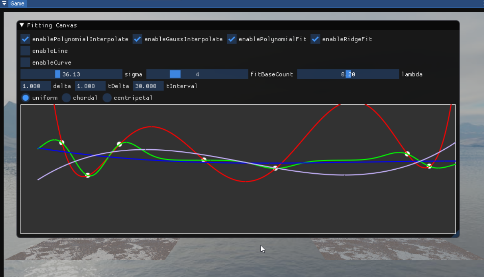
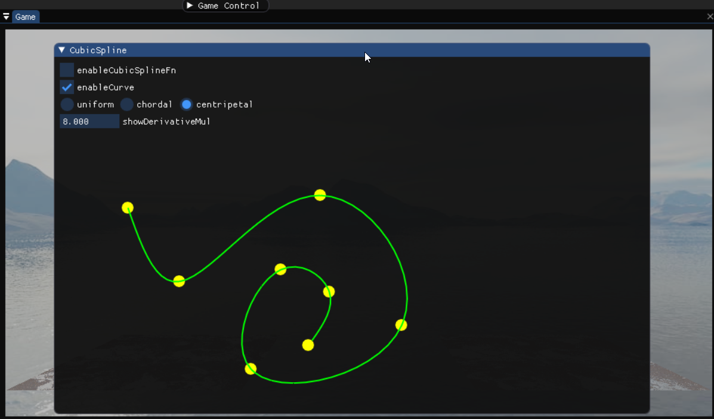
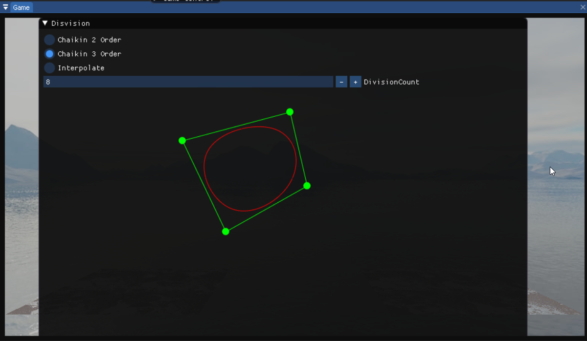
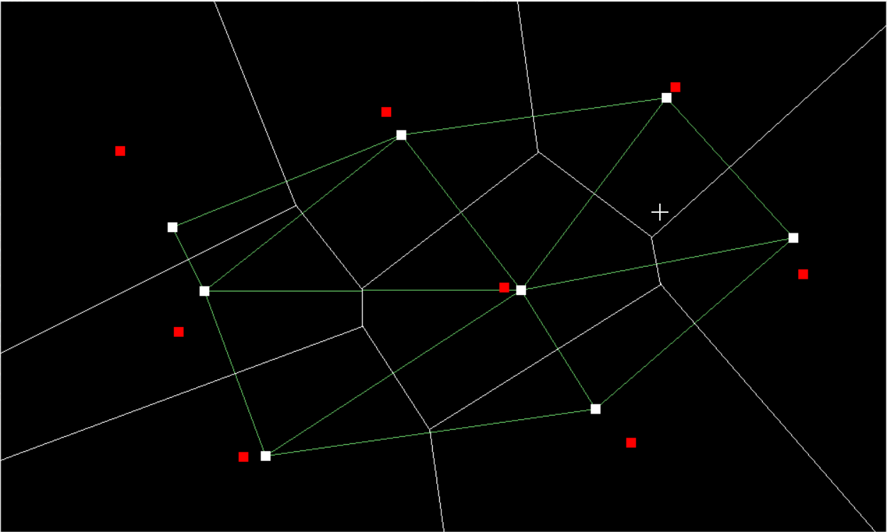
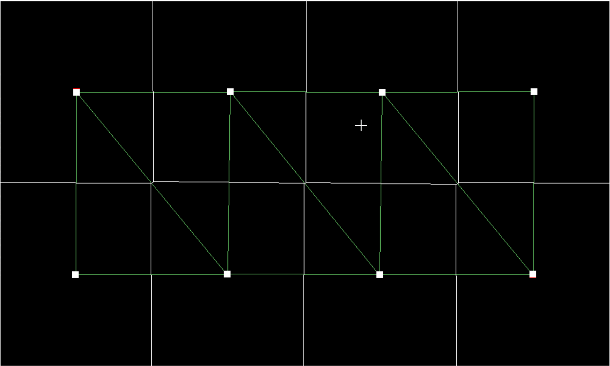

[toc]
# 0. 序言

​	GAMES102课程(几何建模与处理基础)的作业备份.

# 1. 环境部署

​	课程资料的CMake.md文件提供了两种环境安装的方式. 第一种是要下载很多内容, 很容易因为网络波动而失败. 第二种似乎是使用已经预编译的内容, 因此安装会很顺利. Ubpa和Unity的操作很类似.

# 2. 作业内容

## 2.1 函数拟合, 参数曲线拟合

## 2.2 三次样条函数

## 2.3 曲线细分

## 2.4 极小曲面局部和全局方法

​	这部分做的不好(先前能正常执行, 现在会导致严重扭曲)

## 2.5 实现平面点集 CVT 的 Lloyd 算法

​	voronoi图和Delaunay图.

​	Lloyd 算法

## 2.6 网格简化的 QEM 方法

​	这部分做的不好(先前能正常执行, 现在会导致严重扭曲)

## 2.7 神经网络曲线拟合

​	拟合的效果做的不是很好.
