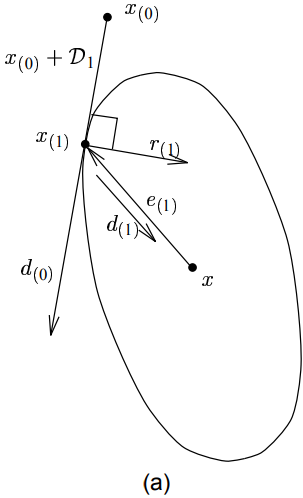
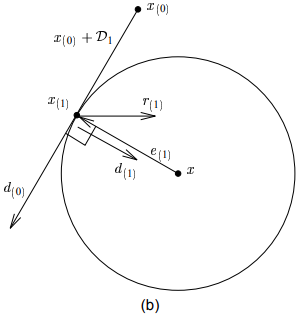

[toc]

# 1. 共轭方向法

​	在最速下降法的每轮迭代中, 移动的方向是当前点的负梯度方向.

​	其实能不能沿其它方向下降呢? 答案是可以的.

## 1.1 矩阵$\cdot$向量正交(共轭)

投影的操作是内积, 当一个量在另一个量的投影为0时, 它们正交.

定义
$$
d^TAd = 0
$$
矩阵$\cdot$向量正交是对$d^T$进行变化后再与自身正交.

同样利用方向导数为0, 找到一次迭代到达最小值的条件
$$
\frac{d}{da}f(x_{i+1}) = \frac{df(x_{i+1})}{d\overline{x}} \cdot \frac{d\overline{x}}{da} \\
= -{r(i+1)}^T \cdot d_i & (方向导数定义是梯度\cdot方向向量) \\
= -({d_i}^T{r(i+1)})^T \\
= ({d_i}^TAe_{i+1})^T \\
=0
$$
方向导数为0时, $d_i和e_{i+1}$矩阵向量正交
$$
{d_i}^TAe_{i+1} = 0 \tag{1.1.1}
$$

## 1.2 共轭方向法的方向选择

共轭方向法选择的方向$D=\{d_0, d_1, d_2, ..., d_n\}$, 两两方向矩阵向量正交
$$
e_{i+1} = e_i + a_id_i & 两边同时乘以{d_i}^TA \\
{d_i}^TAe_{i+1} = {d_i}^TAe_i + a_i{d_i}^TAd_i \\
由1.1.1得 \\
a_i = \frac{-{d_i}^TAe_i}{{d_i}^TAd_i} \\
= \frac{{d_i}^Tr_i}{{d_i}^TAd_i} \tag{1.1.2}
$$
*ps:*

> 文章中是先使用互相正交的向量做为方向, 但这种情况下, 步长是求解不出来的.

## 1.3 证能够在n步上收敛(有n个方向)

将误差向量看作是n个方向的分量
$$
e_0 = \sum_j^n \omega_j d_j
$$
两边同时乘以${d_i}^TA$
$$
{d_{i}}^TAe_i = {d_{i}}^TA \sum_j^n \omega_j d_j \\
= w_i {d_i}^T A d_i & 此时i=j, 当i\neq j矩阵向量结果为0 \\
$$

$$
w_i = \frac{{d_{i}}^TAe_i}{{d_i}^T A d_i} \\
= -\frac{{d_{i}}^Tr_i}{{d_i}^T A d_i} \\
= -a_i \tag{1.3.1}
$$

由1.3.1可知, 每一步迭代$a$的步长都是消除误差向量在$b_i$处的分量$w_i$

# 2. 格莱姆-施密特共轭方法

​	现在的问题是如何找到一系列矩阵向量正交的方向组

​	格莱姆-施密特共轭提供了一种简单的方法, 步骤如下

1. 寻找一些列线性无关的向量$v_0, v_1, ..., v_n$.
2. 取其中一个, 这里取$v_0$为做为$d_0$.
3. 任取另外一个向量$v_i$, 保留该向量中**与已经得到的所有方向都共轭的分量**, 该分量记为$d_i$
4. 重复3, 直到n个向量都被选取

格莱姆-施密特共轭的公式为
$$
d_i = v_i - \sum_j^{i-1}u_{ij}d_j
$$
其中$u_{ij}$表示$v_i$在方向$d_j$上的分量大小, 减去就能消去这部分分量, 保留共轭的部分.
$$
{d_i}^TAd_k= {v_i}^TAd_k - \sum_j^{i-1}u_{ij}{d_j}^TAd_k & (k<i)\\
= {v_i}^TAd_k - u_{ik}{d_k}^TAd_k & (j=k) \\
$$
由${d_i}^TAd_k=0$得
$$
u_{ik} = \frac{{v_i}^TAd_k}{{d_k}^TAd_k} & (k<i)\tag{2.0.1} \\
$$

## 2.1 能量范式在方向上的分解

$$
{||e_i||_A}^2 = ||e_i||^TA||e_i|| \\
= \sum_{j=i}^{n-i} \omega_j d_j A \sum_{k=i}^{n-i} \omega_k d_k\\
= \sum_{j=i}^{n-i}{w_j}^2{d_j}^TAd_j & j=k\\
$$

*摘自原文*	

> ​	上述累和项中的每一项都与一项尚未使用过的搜索向量相关联. 所有从$e_0 + D_i$中选择的任意向量$e$的展开式同样也是包含上述这些项, 因此$e_i$必然具有最小的能量范式(因任意两个方向向量的矩阵乘积全为0, 原累和项变成各个方向向量的线性组合).

我的理解是, 共轭方向法每一步消除误差向量在一个方向上的分量; 在能量范式中, 则表示为消除一个方向上的能量项, 能够消除的部分是有限的. (因为这次迭代只影响一个方向, 其它方向不受影响). 减去这方向的所有能量分量, 即是最小值.

## 2.2 共轭方向法的二维实例

这是自己的理解

设
$$
\frac{e_{i+1}}{e_i} = k \\
$$
则
$$
\frac{||e_{i+1}||_A}{||e_i||_A} \\
= (\frac{{e_{i+1}}^TAe_{i+1}}{{e_i}^TAe_i})^{\frac{1}{2}} \\
= (\frac{k{e_i}^TAke_i}{{e_i}^TAe_i})^{\frac{1}{2}} \\
= k \tag{2.2.1}
$$
可以得到点的能量范式之比和误差向量长度成正比.

由$f(p)-f(x) = \frac{1}{2}(e_p)^TA(e_p)$, 能量范式相同的点, 他在$f(x)$具有相同的值.

一般情况下, 能量范式($f(x)$值相同的点)构成了一个等值线.

经过拉伸(**文章中并没有论述如何拉伸, 也就是怎么变化**)后, 能量范式等值线**严格以最小解为圆心构成一系列等值圈**.

回想共轭定义
$$
{d_i}^TAd_j=0
$$
共轭方向法的方向满足
$$
d_iAe_{i+1} = 0
$$
共轭表明表明$e_{i+1}$经过变化后与$d_i$正交.

由圆的定义在以$x(0) + d_0$为切线的圆中, $x(1)-x$与$x(0) + d_0$垂直, 那么$x(1)-x$是圆的直径, $x(1)$到圆心的距离最短.

由2.2.1得在拉伸的等值线图中, $e$越大, 能量范式越大. 所以相切的圆是$x(0) + d_0$所能到达的能量范式中的最小值所在处(**在三维以上表现为与球体或超球体相切**).

**与圆, 球体或超球体相切, 此时到达中心点表示最小值**.

## 2.3 各种正交关系

定义空间
$$
spanD_i=\{d_0, d_1, d_2,...,d_{i-1}\}
$$
*上一点的最后, 准确的表达可能是超平面$x(0)+D_i$与方向$d_i$和最小值点$x$构成的椭球体相切.*
$$
e_j = e_0 - \sum_{i=0}^{j-1}a_id_i \\
= \sum_{i=0}^{n-1}a_id_i - \sum_{i=0}^{j-1}a_id_i \\
= \sum_{i=j}^{n-1}a_id_i \tag{2.3.1}
$$

* **残差向量与所有已经搜索过的方向正交**

  证明
  $$
  由2.3.1得, 左右同时乘以-{d_k}^TA \\
  -{d_k}^TAe_j = -\sum_{i=j}^{n-1}a_i{d_k}^TAd_i \\
  = 0 & k < j 时 \\
  {d_k}^T \cdot r_j = 0 & k<j时\\ \tag{2.3.2}
  得证
  $$
  因此$r_j$与所有$d_k$张成的空间均正交. 表示为$r_j \cdot [x(0)+D_i]$.

* **残差向量递归式**
  $$
  由e_{i+1} = e_i + a_id_i \\
  r_{i+1} = r_i - a_iAd_i \tag{2.3.3}
  $$

* **残差向量与选取的方向正交**
  $$
  由d_i = u_i - \sum_{j=0}^{i-1}w_{ij}d_j & 两边同时左乘{r_k}^T得 \\
  {r_k}^Td_i = {r_k}^Tu_i - \sum_{j=0}^{i-1}w_{ij}{r_k}^Td_j \\
  0 = {r_k}^Tu_i - 0 & k > i时, 由2.3.2得 \\
  {r_k}^Tu_i = 0 \tag{2.3.4} & k>i>j
  $$

  $$
  {r_i}^Tu_i = {r_i}^Td_i & k=i>j时 \\ \tag{2.3.5}
  $$

# 3. 共轭梯度法

​	在共轭方向法中, 随机选取n个线性无关的方向做为迭代方向; 而共轭梯度法选取
$$
D_i = \{r_0, r_1, r_2, ..., r_{i-1} \}
$$
因为$d_0 = r_0$. 由2.3.3得$r_1 = d_0 - a_0Ad_0$; $r_2=r_1 - a_1Ad_1$

可见$r_i$是$d_j(j<i)$的线性组合

在梯度法中, $d_i$是由$r_i$变化而来($d_i = r_i - \sum_jw_{ij}d_j$), 所以$d_i$是$r_i$的线性组合.

* 空间变化

$$
由2.3.3和d_i和r_i的线性关系 \\
新增加一维基向量(d_i)时, 是在原有的子空间D_i上增加一个AD_i的子空间\\
D_{i+1} = D_i + AD_i
$$

*这部分真的不好理解, 还是参考原文吧*

## 3.1 共轭方向法的不足

*摘自原文*

>​	在共轭方向法中使用`共轭格莱姆-施密特过程`（计算搜索向量）的一个不利的地方是，每一轮新的迭代之前的所有搜索向量都需要保存下来，以便用来计算本轮的搜索方向，这就导致要计算出所有的搜索向量，其操作的复杂度为$O(n^3)$。实际上，如果搜索向量由轴向单位向量的共轭组成，那么共轭方向等价于进行高斯消元法.
