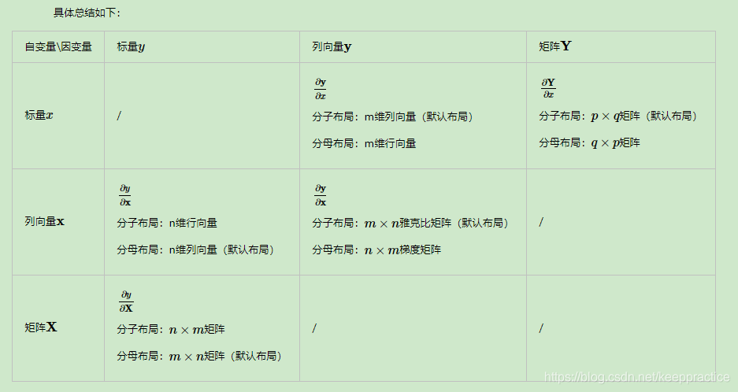
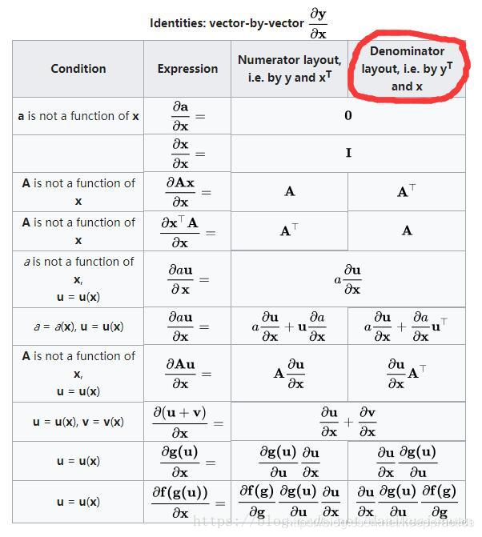
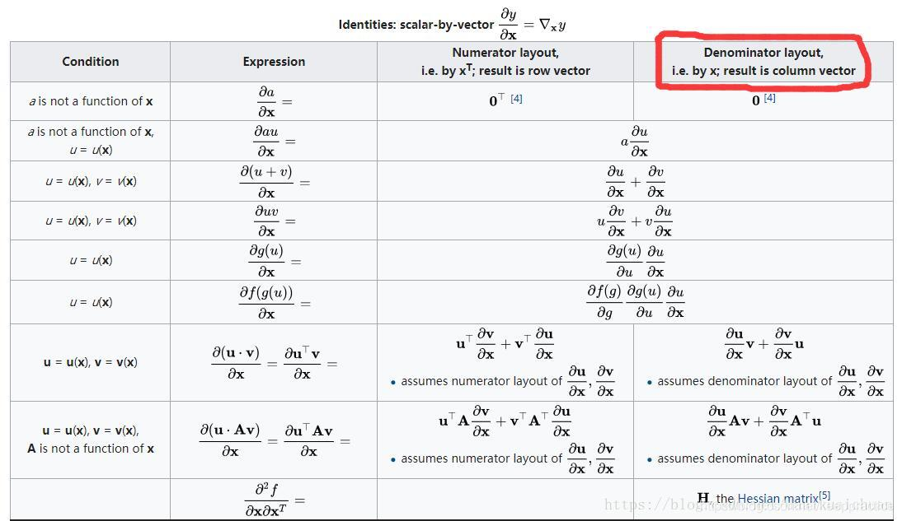
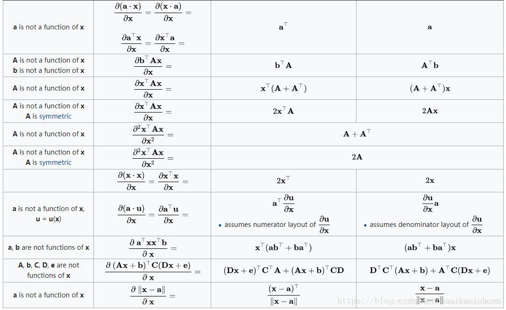
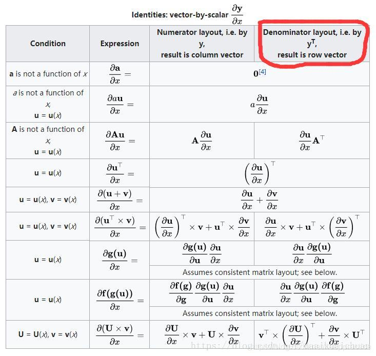

[toc]

# 0. 序言

​	线性代数做为一个数学工具, 在众多其它领域中都有应用. 当初学习的时候面对一堆公式和定义, 真的觉得无聊. 现在都忘完了, 但在需要使用的时候, 真的觉得很奇妙. 以下是对使用到的线性代数知识做记录.

# 1. 矩阵运算

​	矩阵最基本的运算, 如数乘, 相乘就不记录了.

​	需要注意的是
$$
(AB)^T = B^TA^T \\
(AB)^{-1} = B^{-1}A^{-1}
$$

# 2. *标量, 矩阵, 向量间的求导

## 2.1 梯度

$$
{\nabla}f = \sum_{i=1} \frac{\part{f}}{\part{x_i}}
$$

梯度可以看作是标量(函数)对向量的求导

## 2.2 分子布局和分母布局

​	在讨论求导结果前, 需要先商量好布局方式. 一个列向量(n\*1)对行向量(1\*m)求导结果是n\*m矩阵还是m\*n矩阵.

​	这里有两种布局方式

### 2.2.1 分子布局

分子布局中以分子的维度为准

* 分子布局的原则一

  向量**f**是n维列向量, x是标量. 

$$
\frac{\part{f}}{\part{x}}=
\left[
\begin{matrix}
\frac{\part{f_{x_1}}}{x} \\
\frac{\part{f_{x_2}}}{x} \\
\frac{\part{f_{x_3}}}{x} \\
... \\
\frac{\part{f_{x_n}}}{x}
\end{matrix}
\right]
$$

​		向量**f**是n维行向量, x是标量. 
$$
\frac{\part{f}}{\part{x}}=
\left[
\begin{matrix}
\frac{\part{f_{x_1}}}{x} & 
\frac{\part{f_{x_2}}}{x} & 
\frac{\part{f_{x_3}}}{x} & 
... &
\frac{\part{f_{x_n}}}{x}
\end{matrix}
\right]
$$

* 分子布局的原则二

  向量**f**是n维向量, x是标量. 

$$
\frac{\part{x}}{\part{f}}=
\left[
\begin{matrix}
\frac{\part{x}}{f_{x_1}} & 
\frac{\part{x}}{f_{x_2}} & 
\frac{\part{x}}{f_{x_3}} & 
... &
\frac{\part{x}}{f_{x_n}}
\end{matrix}
\right]
$$

向量的求导本质是向量分量的求导.

* 原则三

**不变的准则是, 分子中的分量分别对分母的所有分量求导**

### 2.2.2 分子布局下的向量与向量求导

**a**是n维行向量; **b**是m维列向量.

1. 根据原则三: 先是元素$a_1$对向量**b**求导
2. 根据原则一: 元素$a_1$对向量**b**求导的结果是行向量
3. 剩下元素$a_i$分别对向量**b**求导, 得到n-1个行向量
4. 得到结果

$$
\frac{\part{a}}{\part{b}} =
\left[
\begin{matrix}
\frac{\part{a_1}}{\part{b_1}} & \frac{\part{a_1}}{\part{b_2}} &
... & \frac{\part{a_1}}{\part{b_m}} \\
\frac{\part{a_2}}{\part{b_1}} & \frac{\part{a_2}}{\part{b_2}} &
... & \frac{\part{a_2}}{\part{b_m}} \\
... \\
\frac{\part{a_n}}{\part{b_1}} & \frac{\part{a_n}}{\part{b_2}} &
... & \frac{\part{a_n}}{\part{b_m}}
\end{matrix}
\right]
$$

> 分母布局则以分母的维度为准, 
>
> 当分母为标量时, 结果是行向量. 
>
> 分子布局和分母布局的结果**相差一个转置**

## 2.3 小结

## 2.4 例

* 求$x^T A x$的导数

$$
\frac{\part{x^T A x}}{\part{x}} = \frac{\part\sum_{k=1}\sum_{i=1}{x_i a_{ij}}{x_k}}{\part{x_n}}
$$

​	对于结果矩阵的元素表达式, j是常量.
$$
\begin{cases}
2x_ia_{ij}, & i=k=n \\
\sum_{i=1} x_i a_{ij}, & k=n\&\& i\neq n \\
\sum_{k=1} a_{ij} x_k, & k \neq n \&\&i=n \\
0, & k \neq n \&\& i \neq n
\end{cases}
$$
​	组合一下得
$$
\begin{cases}
\sum_{i=1} x_i a_{ij}, & k=n \\
\sum_{k=1} a_{ij} x_k, & i=n \\
0, & k \neq n \&\& i \neq n
\end{cases}
$$
​	即$\frac{\part{x^T A x}}{\part{x}} = Ax + A^Tx$(分子布局)

## 2.5 矩阵运算公式

## 2.6 参考

[[机器学习-数学\] 矩阵求导(分母布局与分子布局)，以及常用的矩阵求导公式_矩阵在分母上怎么算-CSDN博客](https://blog.csdn.net/keeppractice/article/details/107231685)

# 3. 主子式

​	设A是n阶方阵, 选取其中的k行和k列(k<n)组成一个新的方阵, 该方阵称为k阶主子式

## 3.1 顺序主子式

​	设A是n阶方阵, A的前i行和前i列(i=1,2,3,...,n)组成的i个主子式被称为顺序主子式.

# 4. *特征值和特征向量

​	一个矩阵意味着一种线性变化, 对于矩阵A, 如果存在向量**x**, 使得A**x**=$\lambda$**x**.

也就是说存在这样的向量, 在A变化下**是自身的放缩**. **x**称为**特征向量**, $\lambda$称为**特征值**

## 4.1 特征值求解

$$
Ax = \lambda x \\
Ax - \lambda x = 0 \\
(A - \lambda I) x = 0
$$

​	因为式子为齐次方程, 若x为非零向量, 那么矩阵($A-\lambda I$)就是奇异矩阵(非满秩), **行列式为0**.

将行列式展开, 得到**最高次为n的关于$\lambda$的方程, 易得方程有n个解**.

## 4.2 谱半径

​	设**x**是A的一个特征向量, 对应的特征值为$\lambda$, 如果|$\lambda$|<1

易得$A^ix=\lambda^ix, 当i\rightarrow \infin; A^ix\rightarrow \overline{0}$.

* 谱半径的定义

$$
\rho(A)=max(\lambda)
$$

若|$\rho$|<1, 那么任意向量**y**可以看作是**A的特征向量的线性组合(或者说y在A特征向量的分量)**.

每个分量不断缩小, 趋近于**0**.

谱半径绝对值小于1是众多变化矩阵**收敛**的条件.

* 变化矩阵的本质

​	矩阵的作用是变化坐标系(**以特征向量为基向量表示原向量, 不要求必须正交**)

​	非满秩的n维方阵表示存在一个特征向量, 可以使用另外的特征向量线性组合得到.(线性无关的特征向量数量小于n)

* 条件范数的定义

$$
f(A) = \frac{max(\lambda_i)}{min(\lambda_j)}
$$

​	条件范数表示矩阵的稳定性, 条件范数越大, 矩阵越不稳定, (在特征向量上的投影差距大)

### 4.2.1 例

如何求$A^{100}$的结果

解: 
$$

1. 将A分解为PBP^{-1} \\
2. B为对角线矩阵(出对角线外其余元素为0) \\
3. A^{100} = PB^{100}P^{-1}
$$

# 5. 特殊矩阵

## 5.1 对称矩阵

​	定义: 对称矩阵$A=A^T$, 任何$(A+A^T)$都是对称矩阵.

## 5.2 正定矩阵

​	定义: $x^TAx>\overline{0}$, 其中x为非0向量.

### 5.2.1 A为正定矩阵的充要条件

* 矩阵的顺序主子式均大于0
* 矩阵的特征值均大于0
* 存在列满秩矩阵R，使得 $A = R^T R$

## 5.3 病态矩阵

​	病态矩阵就是条件范数大的矩阵, 它的稳定性不好. 给任何元素微小的扰动, 都会导致结果发生巨大的变化.

